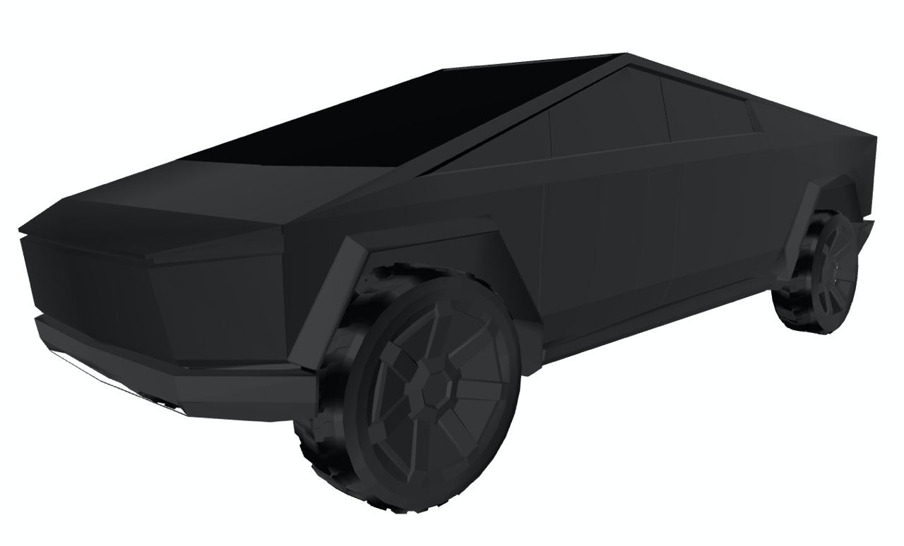
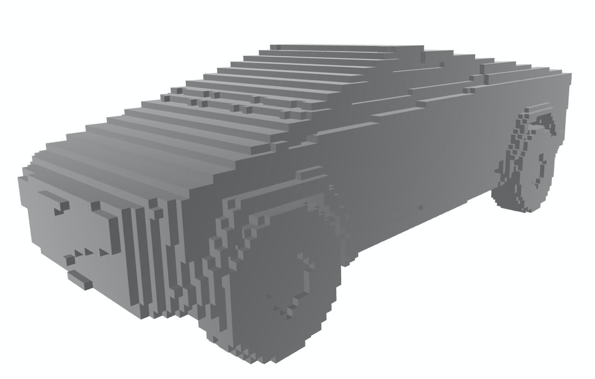
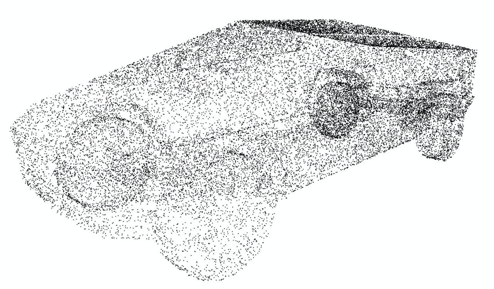
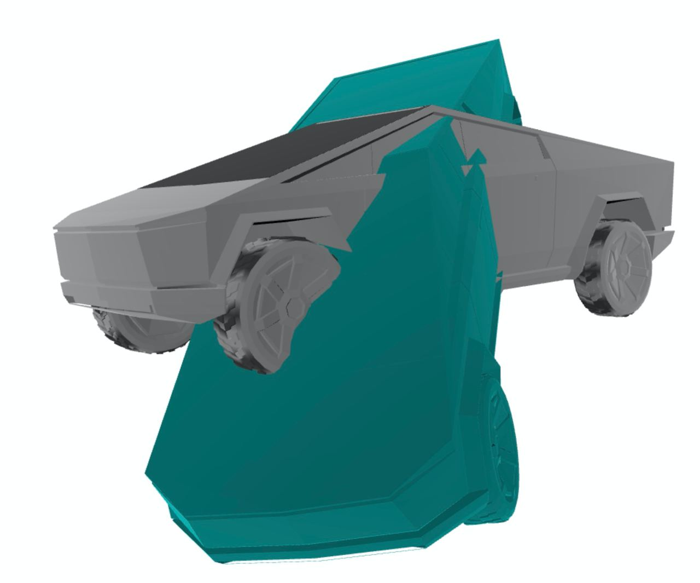
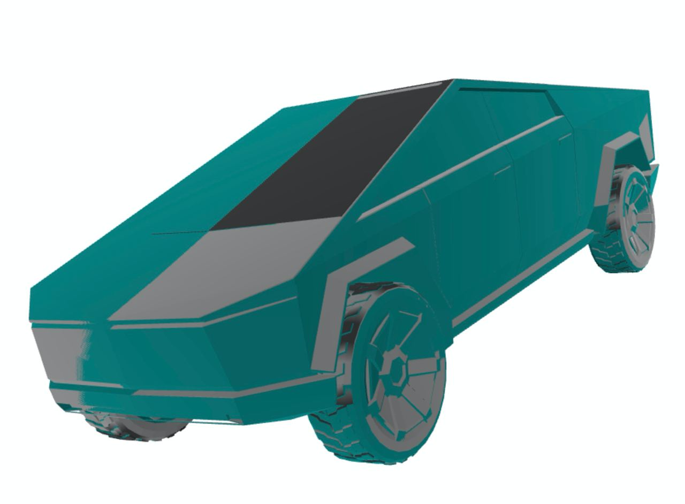
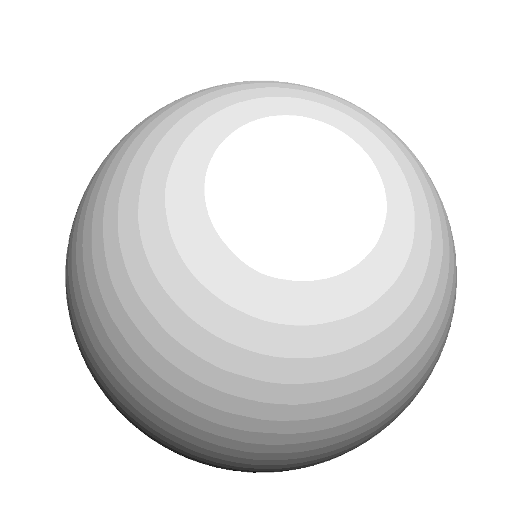

# 3D ML
3D ML labs using trimesh, pytorch3d and sketchfab

## Lab 1
Choose initial model and convert mesh representation into voxels/point cloud.
Used model - [Cybertruck](https://sketchfab.com/3d-models/low-poly-tesla-cybertruck-5d5d84862b1046b7983433938cd9fbe6)

1. Mesh representation

2. Voxels representation

3. Point cloud representation

## Lab 2
### ICP algorithm
1. Combined models containing "error"

2. Restored version result

### Make a cybertruck from sphere!

