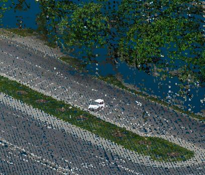
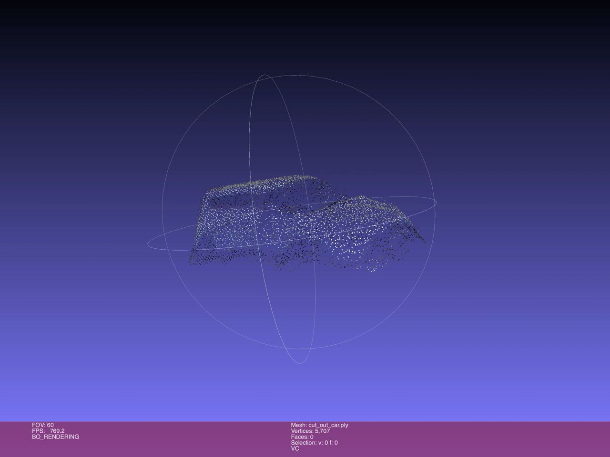
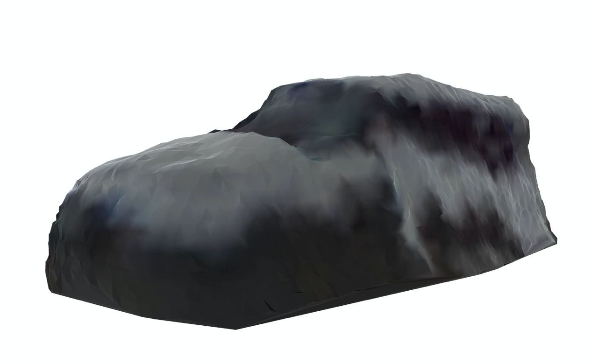
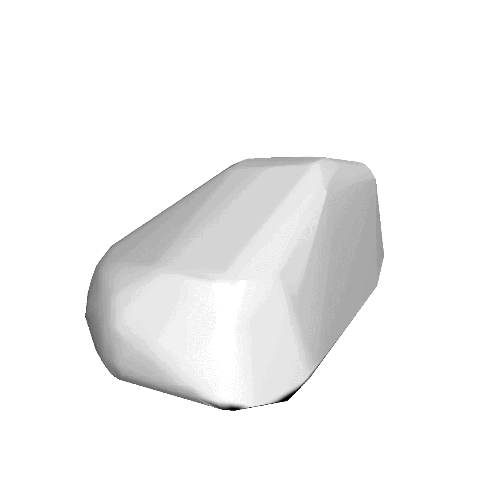

# 3D ML
3D ML labs using trimesh, pytorch3d and sketchfab

## Lab 1
Choose initial model and convert mesh representation into voxels/point cloud.
Used model - [Cybertruck](https://sketchfab.com/3d-models/low-poly-tesla-cybertruck-5d5d84862b1046b7983433938cd9fbe6)

1. Mesh representation

2. Voxels representation

3. Point cloud representation

## Lab 2
### ICP algorithm
1. Combined models containing "error"

2. Restored version result

### Make a cybertruck from sphere!

## Final lab
1. Load points cloud of some environment and find some car (using CloudCompare)

3. Clean out bad points from it and convert cloud to mesh (using Meshlab)

4. Using previous steps from labs 1&2 convert car's mesh into plane's mesh (note: convex hull is used)

